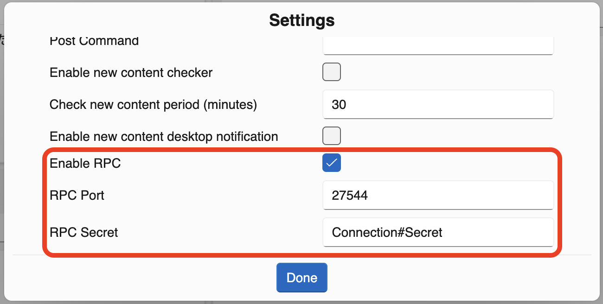
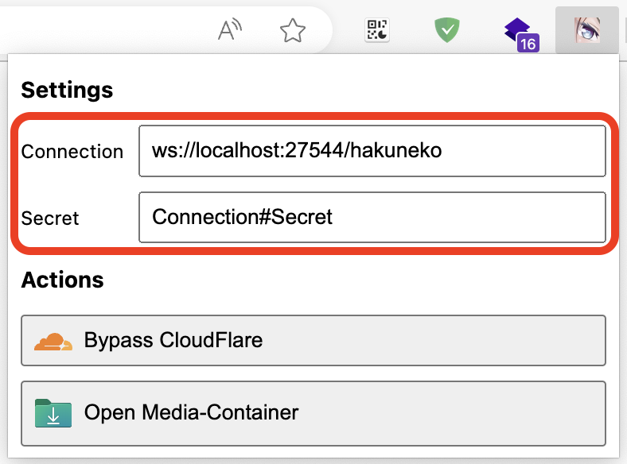

# Connect with HakuNeko

1. Start HakuNeko and open the Settings
   - Enable the option for Remote Control from 3rd Party Applications
   - You may change the `Port` on which HakuNeko is listening to 3rd Party Applications
   - You must change the default `Secret` to prevent connections from unauthorized Users

   

2. Install the HakuNeko Assistant Browser Extension for Chrome/Edge
   - Download the latest extension from [GitHub](https://github.com/manga-download/haruneko-assistant/releases)
   - Extract the content of the Extension (Zip Archive)
   - Open Chrome/Edge and switch to the Extension Manager
   - Enable Developer Mode and Load the unpacked Extension from its Directory

3. Open the Extension in your Browser
   - Make sure the `Connection` uses the same `Port` as configured in HakuNeko
   - Make sure the `Secret` is the same as configured in HakuNeko

   

4. Bypass CloudFlare protected Website
   - Make sure HakuNeko is running and Remote Control is enabled
   - In your Chrome/Edge Browser navigate to a manga website protected by CloudFlare
   - Wait until the CloudFlare protection/captcha is bypassed
   - Open the HakuNeko Assistant Extension
   - Click the `Bypass CloudFlare` button
   - This website can now be accessed by HakuNeko (until the CloudFlare session expires)